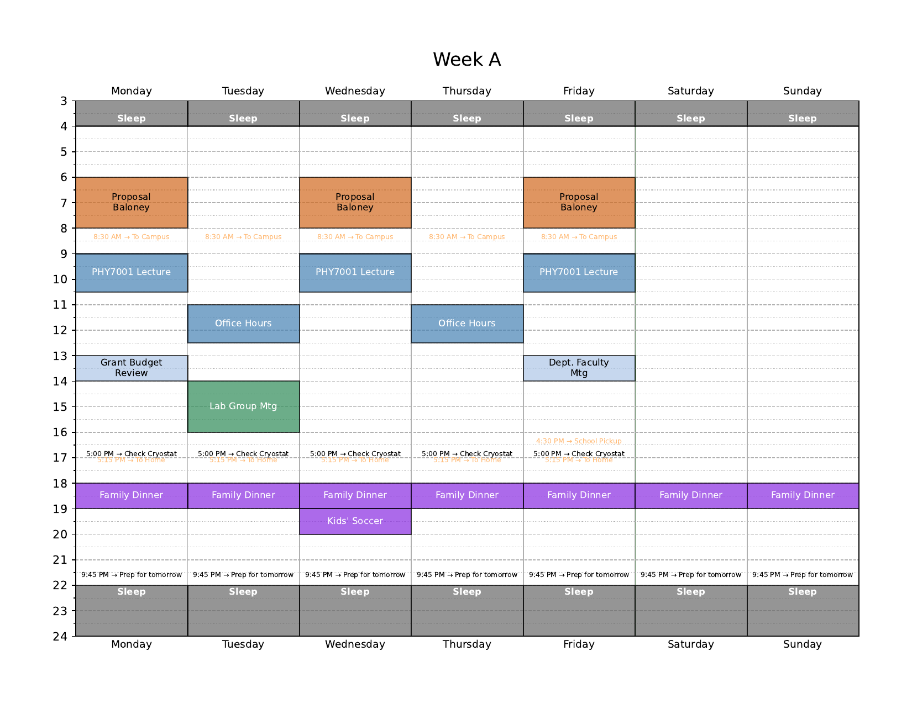

# Unschedule Analyzer

A terminal-based application for visualizing and analyzing your weekly schedule using the 'unschedule' method. It provides a live-reloading interface to instantly see how changes to your schedule affect your time allocation.



## Features

*   **Live Reloading**: Automatically re-generates calendars and statistics when your schedule file is saved.
*   **Interactive TUI**: A terminal interface to toggle settings like page orientation and refresh analysis on command.
*   **Bi-Weekly PDF Calendars**: Generates clean, printable PDFs for "Week A" and "Week B" schedules.
*   **Time Allocation Analysis**: Provides a detailed report of how your time is spent, including a summary of work vs. non-work hours.
*   **Overlap Detection**: Scans your entire schedule and warns you about conflicting time blocks.

## Installation

This project is managed with Poetry.

1.  **Clone the repository:**
    ```sh
    git clone https://github.com/jhamlin-ufl/unscheduler.git
    cd unscheduler
    ```

2.  **Install dependencies:**
    This will install all necessary libraries, including `matplotlib`, `watchdog`, and `textual`.
    ```sh
    poetry install
    ```

## Usage

Run the application from the project's root directory, passing your schedule file as an argument.

```sh
python main.py schedule.txt
```

This will launch the interactive terminal interface.

### Interactive Controls

*   `(o)`: Toggles page orientation between Landscape and Portrait.
*   `(t)`: Opens a dialog to set the visible time range on the calendar.
*   `(r)`: Forces a manual refresh of the analysis and PDFs.
*   `(q)`: Quits the application.

## The `schedule.txt` File Format

This is a plain text file where you define your entire schedule. Lines starting with `#` are ignored.

### Category Definitions

You can define categories and assign them a specific color. Any category used without a pre-definition will be auto-colored.

**Format:** `@CategoryName: color`
```text
@Teaching: #4682B4
@Lab: #2E8B57
```

You can also set the "active" category for subsequent events by using the name alone:
```text
@Writing
# All events below here will be assigned to the "Writing" category
```

### Event Blocks (Duration)

**Format:** `Recurrence DayString StartTime EndTime Description`

*   **Recurrence:** `Weekly`, `WeekA`, or `WeekB`.
*   **DayString:** A string of single-character day codes (`M`, `T`, `W`, `R` for Thursday, `F`, `S`, `U` for Sunday). Example: `MWF`.
*   **StartTime/EndTime:** Flexible formats like `9a`, `5pm`, `14:30`.
*   **Description:** The rest of the line.

**Example:**
```text
WeekA T 2p 4p Lab Group Mtg
```

### Event Triggers (Instantaneous)

**Format:** `Recurrence DayString Time Description`

**Example:**
```text
Weekly MTWRF 5p Check Cryostat
```

### Inline Category Override

Add `@CategoryName` to the end of any event line to assign it a specific category, overriding the active one.

**Example:**
```text
Weekly F 1p 2p Dept. Faculty Mtg @Admin
```

### Non-Work Definition

To power the statistics report, you can define which of your categories should be considered "non-work" time.

**Format:**
```text
[NON-WORK-DEFINITION]
non_work_categories = Sleep, Family, Commute
```

---

### Full Example `schedule.txt`

```text
# =============================================================
# Unschedule Configuration for an Experimental Physics Prof
# =============================================================

[NON-WORK-DEFINITION]
non_work_categories = Sleep, Family, Commute

# --- Category Definitions ---
@Teaching: #4682B4
@Lab: #2E8B57
@Family: #8A2BE2
@Writing: #D2691E
@Sleep: #696969

# --- Teaching ---
@Teaching
Weekly MWF 9a 10:30a PHY7001 Lecture
Weekly TR 11a 12:30p Office Hours

# --- Lab & Research ---
@Lab
WeekA T 2p 4p Lab Group Mtg
WeekB T 2p 4p Student Mtgs
Weekly MTWRF 5p Check Cryostat

# --- Deep Work ---
@Writing
Weekly MWF 6a 8a Paper/Proposal

# --- Admin ---
Weekly F 1p 2p Dept. Faculty Mtg @Admin
WeekA M 1p 2p Grant Budget Review @Admin

# --- Family & Commute ---
@Family
Weekly MTWRFSU 6p 7p Family Dinner
Weekly W 7p 8p Kids' Soccer

# Commute gets its own auto-color
Weekly MTWRF 8:30a To Campus @Commute
Weekly MTWRF 5:15p To Home @Commute
Weekly F 4:30p School Pickup @Commute

# --- Personal & Sleep ---
@Sleep
Weekly MTWRFSU 9:45p Prep for tomorrow
Weekly MTWRFSU 10p 4a Sleep
```
